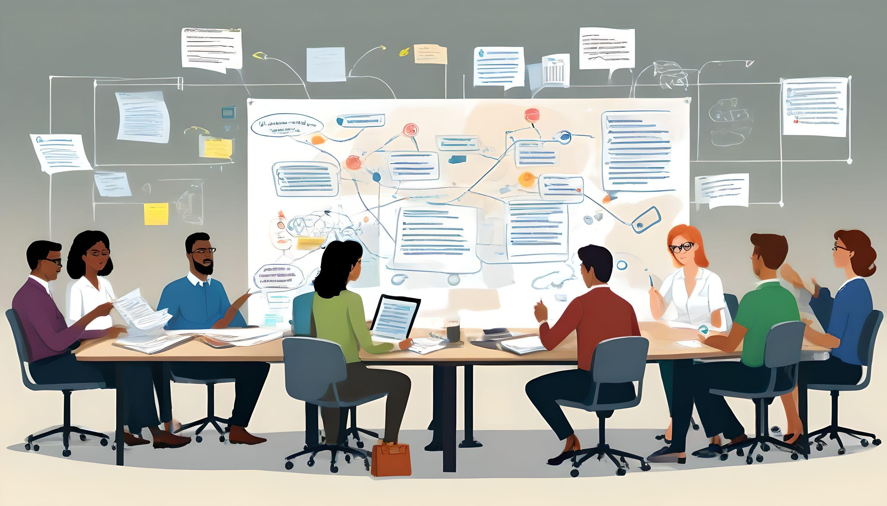
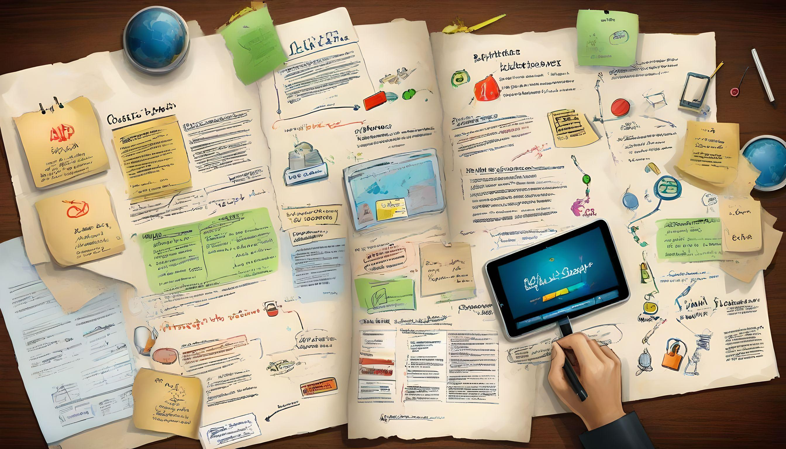
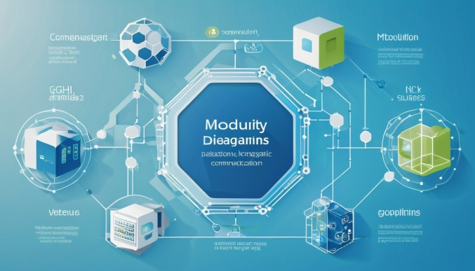
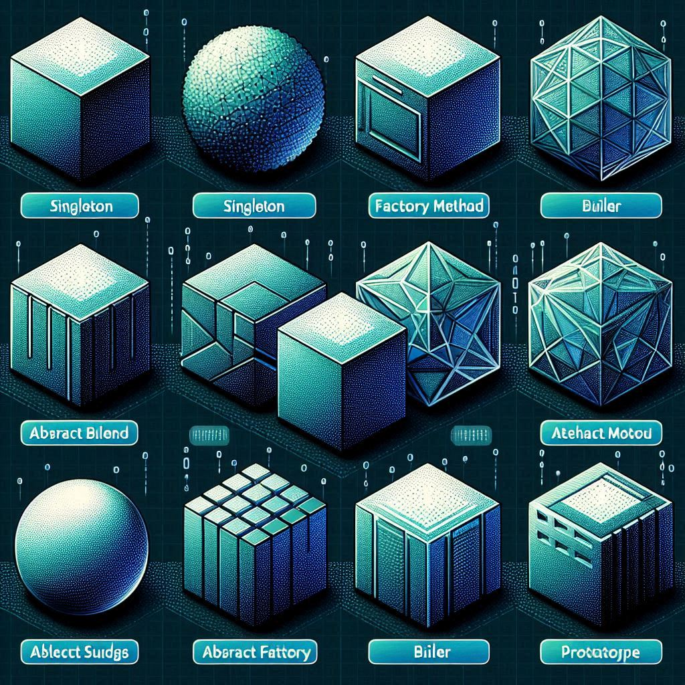

### Aula 26: Conceitos-chave em Engenharia de Requisitos

**Introdução:**
Na Engenharia de Software, a fase de Engenharia de Requisitos desempenha um papel crucial na definição e compreensão dos requisitos do sistema a ser desenvolvido. Nesta aula, exploraremos os conceitos-chave em Engenharia de Requisitos, desde a identificação e análise dos requisitos até a sua documentação e validação.

<!-- **Ilustração 1 (Prompt para geração):**
Processo de Engenharia de Requisitos, mostrando diferentes etapas, como identificação, análise e documentação de requisitos. -->

#### Identificação de Requisitos
A primeira etapa na Engenharia de Requisitos é a identificação de requisitos, onde os stakeholders são consultados para entender suas necessidades e expectativas em relação ao sistema. Isso pode envolver técnicas como entrevistas, workshops e análise de documentos existentes.

<!-- **Ilustração 2 (Prompt para geração):**
Crie uma ilustração que represente uma reunião entre os membros da equipe de desenvolvimento e os stakeholders para identificação de requisitos, mostrando o processo de coleta de informações. -->

#### Análise e Especificação de Requisitos
Após a identificação, os requisitos são analisados ​​e refinados para garantir sua viabilidade e consistência. Isso inclui a especificação de requisitos em uma forma que seja clara, completa e não ambígua. Ferramentas como diagramas de casos de uso e modelos de dados são frequentemente utilizados nesta fase.

<!-- **Ilustração 3 (Prompt para geração):**
Crie uma ilustração que represente o processo de análise e especificação de requisitos, mostrando a elaboração de diagramas de casos de uso e modelos de dados. -->

#### Documentação de Requisitos
Uma vez que os requisitos são identificados e especificados, eles precisam ser documentados de forma clara e compreensível para todas as partes interessadas. Isso pode incluir documentos como especificações de requisitos, protótipos de interface do usuário e modelos de dados.

<!-- **Ilustração 4 (Prompt para geração):**
Crie uma ilustração que represente a documentação de requisitos, mostrando a criação de documentos claros e compreensíveis para todas as partes interessadas. -->

#### Validação de Requisitos
A validação de requisitos é uma etapa crítica para garantir que os requisitos capturados realmente atendam às necessidades e expectativas dos stakeholders. Isso pode envolver revisões formais, prototipagem e simulações para garantir a integridade e a correção dos requisitos.

<!-- **Ilustração 5 (Prompt para geração):**
Crie uma ilustração que represente o processo de validação de requisitos, mostrando uma equipe revisando e testando os requisitos em um ambiente de colaboração. -->

#### Conclusão
A Engenharia de Requisitos é fundamental para o sucesso de qualquer projeto de software, pois define a base sobre a qual todo o sistema será construído. Ao compreender os conceitos-chave e as melhores práticas em Engenharia de Requisitos, os profissionais de software podem garantir que os sistemas atendam às necessidades e expectativas dos stakeholders.

---

**Atividade Avaliativa**

**Aluno: _________________________________________________________________________**

1: Qual é a primeira etapa no processo de Engenharia de Requisitos?

a) Validação de requisitos.

b) Análise de requisitos.

c) Identificação de requisitos.

d) Documentação de requisitos.

2: Qual técnica é frequentemente utilizada para identificar requisitos, envolvendo consultas aos stakeholders para entender suas necessidades e expectativas?

a) Entrevistas.

b) Modelagem de dados.

c) Desenvolvimento de protótipos.

d) Revisões formais.

3: Qual é o objetivo da especificação de requisitos?

a) Garantir que os requisitos sejam claros, completos e não ambíguos.

b) Validar os requisitos com os stakeholders.

c) Documentar os requisitos após a implementação.

d) Testar os requisitos em um ambiente de produção.

4: O que envolve a validação de requisitos?

a) Revisões formais.

b) Desenvolvimento de protótipos.

c) Simulações.

d) Todas as opções acima.

5: Qual é a importância da Engenharia de Requisitos em um projeto de software?

a) Define a base sobre a qual todo o sistema será construído.

b) Garante a segurança do sistema.

c) Minimiza os custos de desenvolvimento.

d) Todas as opções acima.

---

**Gabarito:**
1. c) Identificação de requisitos.
2. a) Entrevistas.
3. a) Garantir que os requisitos sejam claros, completos e não ambíguos.
4. d) Todas as opções acima.
5. a) Define a base sobre a qual todo o sistema será construído.

---
---

## Aula 27: Processo de Engenharia de Requisitos

**Introdução:**
Na Engenharia de Software, o processo de Engenharia de Requisitos é fundamental para o sucesso de um projeto. Ele define como os requisitos do sistema serão identificados, analisados, documentados e validados ao longo do ciclo de vida do desenvolvimento de software. Nesta aula, exploraremos detalhadamente o processo de Engenharia de Requisitos e suas principais etapas.

<!-- **Ilustração 1 (Prompt para geração):**
Crie uma ilustração que represente o ciclo de vida do processo de Engenharia de Requisitos, destacando as diferentes fases, como identificação, análise, documentação e validação de requisitos. -->

#### Etapas do Processo de Engenharia de Requisitos

**1. Identificação de Requisitos:**
A primeira etapa do processo é identificar os requisitos do sistema. Isso envolve a colaboração com os stakeholders para entender suas necessidades e expectativas em relação ao produto a ser desenvolvido.

<!-- **Ilustração 2 (Prompt para geração):**
Crie uma ilustração que represente o processo de identificação de requisitos, mostrando a interação entre os membros da equipe de desenvolvimento e os stakeholders. -->

**2. Análise de Requisitos:**
Após a identificação, os requisitos são analisados em detalhes para entender completamente seu escopo e impacto no sistema. Esta etapa visa garantir que os requisitos sejam claros, completos e consistentes.

<!-- **Ilustração 3 (Prompt para geração):**
Crie uma ilustração que represente o processo de análise de requisitos, mostrando a equipe revisando e refinando os requisitos identificados. -->

**3. Documentação de Requisitos:**
Os requisitos são então documentados de forma clara e compreensível para todas as partes interessadas. Isso pode incluir a criação de especificações de requisitos, diagramas de casos de uso e protótipos de interface do usuário.

<!-- **Ilustração 4 (Prompt para geração):**
Crie uma ilustração que represente o processo de documentação de requisitos, mostrando a criação de documentos e diagramas para comunicar os requisitos. -->

**4. Validação de Requisitos:**
A última etapa do processo é validar os requisitos com os stakeholders para garantir que eles atendam às necessidades e expectativas do cliente. Isso pode envolver revisões formais, prototipagem e simulações.

<!-- **Ilustração 5 (Prompt para geração):**
Crie uma ilustração que represente o processo de validação de requisitos, mostrando a equipe apresentando os requisitos aos stakeholders para revisão e feedback. -->

#### Conclusão
O processo de Engenharia de Requisitos é essencial para o desenvolvimento de software de alta qualidade que atenda às necessidades dos usuários finais. Ao seguir um processo bem definido e colaborativo, as equipes de desenvolvimento podem garantir o sucesso do projeto desde o início.

Aqui está uma atividade avaliativa de múltipla escolha para a Aula 27: Processo de Engenharia de Requisitos.

---

**Atividade Avaliativa**

**Aluno: ____________________________________________________________**

1: Qual é a primeira etapa do processo de Engenharia de Requisitos?

a) Análise de Requisitos.

b) Documentação de Requisitos.

c) Validação de Requisitos.

d) Identificação de Requisitos.

2: O que envolve a análise de requisitos?

a) Revisão formal dos requisitos com os stakeholders.

b) Refinamento e compreensão detalhada dos requisitos.

c) Criação de documentos claros e compreensíveis.

d) Testes de validação dos requisitos.

3: Qual é o objetivo da documentação de requisitos?

a) Validar os requisitos com os stakeholders.

b) Garantir que os requisitos sejam claros, completos e não ambíguos.

c) Revisar formalmente os requisitos.

d) Criar um protótipo do sistema.

4: O que envolve a validação de requisitos?

a) Revisão formal dos requisitos com os stakeholders.

b) Refinamento e compreensão detalhada dos requisitos.

c) Criação de documentos claros e compreensíveis.

d) Testes de validação dos requisitos.

5: Qual é a importância do processo de Engenharia de Requisitos?

a) Definir os requisitos de forma rígida para evitar mudanças.

b) Garantir que o sistema atenda às necessidades e expectativas dos stakeholders.

c) Criar uma documentação extensa e detalhada.

d) Acelerar o processo de desenvolvimento de software.

---

**Gabarito:**
1. d) Identificação de Requisitos.
2. b) Refinamento e compreensão detalhada dos requisitos.
3. b) Garantir que os requisitos sejam claros, completos e não ambíguos.
4. a) Revisão formal dos requisitos com os stakeholders.
5. b) Garantir que o sistema atenda às necessidades e expectativas dos stakeholders.

## Aula 28: Documentação de Requisitos

**Introdução:**
A documentação de requisitos desempenha um papel crucial no desenvolvimento de software, fornecendo uma base sólida para o projeto e implementação do sistema. Nesta aula, exploraremos a importância da documentação de requisitos, os tipos de documentos envolvidos e as melhores práticas para sua criação.

<!-- **Ilustração 1 (Prompt para geração):**
Crie uma ilustração que represente um conjunto de documentos de requisitos, como especificações, diagramas e protótipos, formando a base para o desenvolvimento de um sistema de software. -->

#### Importância da Documentação de Requisitos

A documentação de requisitos é essencial por várias razões:

**1. Comunicação Efetiva:**
Documentos claros e precisos facilitam a comunicação entre os membros da equipe de desenvolvimento, stakeholders e clientes. Isso garante que todos tenham uma compreensão comum dos requisitos do sistema.

<!-- **Ilustração 2 (Prompt para geração):**
Crie uma ilustração que represente a comunicação efetiva facilitada pela documentação de requisitos, mostrando diferentes partes interessadas discutindo os requisitos em um ambiente colaborativo. -->

**2. Base para o Desenvolvimento:**
A documentação de requisitos serve como base para o desenvolvimento do sistema, orientando os desenvolvedores sobre o que precisa ser construído e como deve funcionar.

<!-- **Ilustração 3 (Prompt para geração):**
Crie uma ilustração que represente a documentação de requisitos como a base sólida sobre a qual o sistema de software é construído, mostrando desenvolvedores consultando documentos durante o processo de codificação. -->

**3. Gerenciamento de Mudanças:**
Documentos bem elaborados facilitam o gerenciamento de mudanças ao longo do ciclo de vida do projeto, permitindo que as alterações nos requisitos sejam documentadas, avaliadas e implementadas de forma controlada.

<!-- **Ilustração 4 (Prompt para geração):**
Crie uma ilustração que represente o processo de gerenciamento de mudanças facilitado pela documentação de requisitos, mostrando uma equipe revisando e atualizando documentos para refletir alterações nos requisitos. -->

#### Tipos de Documentos de Requisitos

Os documentos de requisitos podem incluir:

- Especificações de Requisitos.
- Diagramas de Casos de Uso.
- Protótipos de Interface do Usuário.
- Matrizes de Rastreabilidade de Requisitos.
- Documentos de Revisão e Aprovação.

<!-- **Ilustração 5 (Prompt para geração):**
Crie uma ilustração que represente os diferentes tipos de documentos de requisitos, mostrando exemplos de cada um e sua aplicação no processo de desenvolvimento de software. -->

#### Melhores Práticas de Documentação

Algumas melhores práticas para a criação de documentação de requisitos incluem:

- Manter a documentação clara, concisa e não ambígua.
- Usar linguagem simples e evitar jargões técnicos desnecessários.
- Incluir exemplos e cenários de uso para ilustrar os requisitos.
- Atualizar regularmente os documentos para refletir mudanças nos requisitos.

<!-- **Ilustração 6 (Prompt para geração):**
Crie uma ilustração que represente as melhores práticas de documentação de requisitos, mostrando uma equipe trabalhando em conjunto para criar documentos claros e concisos. -->

#### Conclusão

A documentação de requisitos desempenha um papel vital no sucesso de um projeto de software, fornecendo uma base sólida para o desenvolvimento e garantindo uma compreensão comum entre todas as partes interessadas. Ao seguir as melhores práticas e manter uma documentação clara e atualizada, as equipes de desenvolvimento podem minimizar erros e maximizar o sucesso do projeto.

Aqui está uma atividade avaliativa de múltipla escolha para a Aula 28: Documentação de Requisitos.

---

**Atividade Avaliativa**

**Aluno:__________________________________________________________**

1: Qual é uma das principais razões para a importância da documentação de requisitos?

a) Facilitar o desenvolvimento de software apenas para os desenvolvedores.

b) Fornecer uma base sólida para o desenvolvimento do sistema.

c) Substituir a comunicação direta entre os membros da equipe.

d) Reduzir a necessidade de gerenciamento de mudanças.

2: O que facilita a documentação de requisitos?

a) Linguagem técnica complexa.

b) Especificações ambíguas e vagas.

c) Exemplos e cenários de uso claros.

d) Manutenção de documentação desatualizada.

3: Quais tipos de documentos podem fazer parte da documentação de requisitos?

a) Apenas diagramas de classe.

b) Apenas protótipos de interface do usuário.

c) Especificações de requisitos, diagramas de casos de uso, protótipos de interface do usuário, entre outros.

d) Apenas documentos de revisão e aprovação.

4: Qual é uma das melhores práticas para a documentação de requisitos?

a) Manter a documentação complexa e repleta de jargões técnicos.

b) Incluir exemplos e cenários de uso para ilustrar os requisitos.

c) Atualizar os documentos apenas no final do projeto.

d) Evitar a comunicação com os stakeholders durante o processo de documentação.

5: Por que a documentação de requisitos facilita o gerenciamento de mudanças?

a) Porque torna as mudanças desnecessárias.

b) Porque permite que as mudanças sejam documentadas, avaliadas e implementadas de forma controlada.

c) Porque torna o processo de mudança mais complicado.

d) Porque evita completamente a necessidade de mudanças.

---

**Gabarito:**
1. b) Fornecer uma base sólida para o desenvolvimento do sistema.
2. c) Exemplos e cenários de uso claros.
3. c) Especificações de requisitos, diagramas de casos de uso, protótipos de interface do usuário, entre outros.
4. b) Incluir exemplos e cenários de uso para ilustrar os requisitos.
5. b) Porque permite que as mudanças sejam documentadas, avaliadas e implementadas de forma controlada.

---

### Aula 29: Projeto de Software - Princípios Fundamentais

---

**Introdução ao Projeto de Software**

O projeto de software é uma fase crucial no ciclo de vida do desenvolvimento de sistemas. Ele envolve a definição de uma solução baseada em software que atenda aos requisitos especificados durante a fase de análise de requisitos. O objetivo do projeto de software é criar uma representação técnica que possa ser transformada em um sistema funcional. Para alcançar esse objetivo, é essencial compreender os princípios fundamentais que guiam essa atividade.

**I. Importância do Projeto de Software**

A qualidade do projeto de software influencia diretamente a qualidade do produto final. Um bom projeto facilita a implementação, a manutenção e a evolução do software, enquanto um projeto mal elaborado pode levar a problemas significativos durante a fase de desenvolvimento e ao longo da vida útil do software. Além disso, um projeto bem estruturado melhora a comunicação entre os membros da equipe de desenvolvimento e os stakeholders, garantindo que todos tenham uma visão clara do sistema a ser desenvolvido.

**II. Princípios Fundamentais do Projeto de Software**

1. **Modularidade**
    - **Descrição:** Modularidade é o princípio de dividir um sistema em partes menores, chamadas módulos, que podem ser desenvolvidas, testadas e mantidas de forma independente.
    - **Benefícios:** A modularidade facilita a compreensão do sistema, melhora a reutilização de código, simplifica a manutenção e permite a paralelização do trabalho de desenvolvimento.

2. **Coesão e Acoplamento**
    - **Coesão:** Refere-se ao grau em que os elementos dentro de um módulo estão relacionados entre si. Um módulo com alta coesão realiza uma única tarefa ou um grupo de tarefas relacionadas.
    - **Acoplamento:** Refere-se ao grau de interdependência entre os módulos. Um bom projeto busca reduzir o acoplamento, permitindo que os módulos funcionem de forma relativamente independente.
   

3. **Abstração**
    - **Descrição:** Abstração é o processo de simplificar a complexidade ao ocultar os detalhes desnecessários e expor apenas as informações essenciais.
    - **Tipos:** Abstração de dados, abstração de controle e abstração de procedimento são formas comuns de aplicar esse princípio.
   
    
4. **Encapsulamento**
    - **Descrição:** Encapsulamento é o princípio de esconder os detalhes internos de um módulo e expor apenas os elementos necessários para o uso do módulo. Isso é alcançado através de interfaces bem definidas.
    - **Benefícios:** Facilita a manutenção, melhora a modularidade e protege o estado interno dos objetos.

    

5. **Separação de Responsabilidades**
    - **Descrição:** Este princípio sugere que diferentes funcionalidades ou preocupações de um sistema devem ser gerenciadas por diferentes partes do sistema.
    - **Aplicação:** Usado amplamente em arquiteturas como MVC (Model-View-Controller) e microservices.
    
**III. Métodos de Projeto de Software**

1. **Projeto Estruturado**
    - **Descrição:** Enfatiza o uso de diagramas de fluxo de dados e hierarquias de controle para representar o sistema.
    - **Técnicas:** Diagramas de fluxo de dados (DFD), diagramas de estrutura hierárquica.

2. **Projeto Orientado a Objetos**
    - **Descrição:** Baseia-se em conceitos de objetos, classes, herança e polimorfismo.
    - **Técnicas:** Diagramas de classes, diagramas de sequência, diagramas de estado.

   

**IV. Boas Práticas no Projeto de Software**

1. **Documentação Completa e Atualizada**
    - Manter uma documentação detalhada e atualizada ajuda na compreensão do sistema e na comunicação entre os membros da equipe.
   
2. **Revisões e Avaliações Regulares**
    - Realizar revisões periódicas do projeto para identificar e corrigir problemas antes que se tornem críticos.
    
**Conclusão**

O projeto de software é um processo vital que exige atenção meticulosa aos princípios fundamentais para garantir a qualidade e a eficiência do produto final. Compreender e aplicar corretamente esses princípios, como modularidade, coesão, acoplamento, abstração e encapsulamento, é essencial para o sucesso de qualquer projeto de software. Além disso, seguir boas práticas e utilizar métodos adequados de projeto estruturado e orientado a objetos ajuda a criar sistemas robustos e manuteníveis.

---

### Atividade Avaliativa de Múltipla Escolha para a Aula 29: Projeto de Software - Princípios Fundamentais

**1. Qual é o principal objetivo do projeto de software?**

a) Testar o software em diferentes ambientes.
b) Criar uma representação técnica que possa ser transformada em um sistema funcional.
c) Implementar o software utilizando linguagens de programação.
d) Manter e atualizar o software após sua implantação.

**Resposta: b) Criar uma representação técnica que possa ser transformada em um sistema funcional.**

---

**2. Qual princípio de design de software se refere à divisão de um sistema em partes menores que podem ser desenvolvidas, testadas e mantidas de forma independente?**

a) Acoplamento
b) Coesão
c) Encapsulamento
d) Modularidade

**Resposta: d) Modularidade**

---

**3. A redução do acoplamento entre módulos em um sistema de software tem como principal benefício:**

a) Melhorar a performance do sistema.
b) Facilitar a compreensão e manutenção do sistema.
c) Aumentar a complexidade do código.
d) Melhorar a segurança do sistema.

**Resposta: b) Facilitar a compreensão e manutenção do sistema.**

---

**4. O que significa alta coesão em um módulo de software?**

a) O módulo depende de muitos outros módulos.
b) O módulo realiza uma única tarefa ou um grupo de tarefas relacionadas.
c) O módulo contém código redundante.
d) O módulo é difícil de modificar.

**Resposta: b) O módulo realiza uma única tarefa ou um grupo de tarefas relacionadas.**

---

**5. Encapsulamento é um princípio fundamental que:**

a) Aumenta a dependência entre os módulos.
b) Expõe todos os detalhes internos de um módulo.
c) Oculta os detalhes internos e expõe apenas os elementos necessários para o uso do módulo.
d) Dificulta a reutilização de código.

**Resposta: c) Oculta os detalhes internos e expõe apenas os elementos necessários para o uso do módulo.**

---

**6. Qual técnica de design de software enfatiza o uso de diagramas de fluxo de dados e hierarquias de controle?**

a) Design Orientado a Objetos
b) Design Estruturado
c) Design Funcional
d) Design Modular

**Resposta: b) Design Estruturado**

---

**7. No contexto de design de software, o que significa abstração?**

a) Dividir um sistema em partes menores e mais gerenciáveis.
b) Ocultar detalhes desnecessários e expor apenas as informações essenciais.
c) Aumentar a complexidade do código para melhorar a segurança.
d) Integrar todos os módulos em uma única unidade funcional.

**Resposta: b) Ocultar detalhes desnecessários e expor apenas as informações essenciais.**

---

**8. Em um sistema de software, a separação de responsabilidades é importante porque:**

a) Aumenta a complexidade do sistema.
b) Dificulta a comunicação entre os módulos.
c) Permite que diferentes funcionalidades sejam gerenciadas por diferentes partes do sistema.
d) Torna o sistema mais dependente de tecnologias específicas.

**Resposta: c) Permite que diferentes funcionalidades sejam gerenciadas por diferentes partes do sistema.**

---

**9. Qual dos seguintes não é um princípio fundamental do design de software?**

a) Modularidade
b) Coesão
c) Redundância
d) Encapsulamento

**Resposta: c) Redundância**

---

**10. No design orientado a objetos, qual diagrama é usado para representar a estrutura de classes e suas relações?**

a) Diagrama de Fluxo de Dados
b) Diagrama de Caso de Uso
c) Diagrama de Sequência
d) Diagrama de Classes

**Resposta: d) Diagrama de Classes**

---

### Gabarito:

1. b) Criar uma representação técnica que possa ser transformada em um sistema funcional.
2. d) Modularidade
3. b) Facilitar a compreensão e manutenção do sistema.
4. b) O módulo realiza uma única tarefa ou um grupo de tarefas relacionadas.
5. c) Oculta os detalhes internos e expõe apenas os elementos necessários para o uso do módulo.
6. b) Design Estruturado
7. b) Ocultar detalhes desnecessários e expor apenas as informações essenciais.
8. c) Permite que diferentes funcionalidades sejam gerenciadas por diferentes partes do sistema.
9. c) Redundância
10. d) Diagrama de Classes

---

### Aula 30: Padrões de Projeto

---

**Introdução aos Padrões de Projeto**

Os padrões de projeto são soluções comprovadas para problemas recorrentes no desenvolvimento de software. Eles representam melhores práticas que os desenvolvedores podem utilizar para resolver problemas comuns de maneira eficiente e eficaz. O conceito de padrões de projeto surgiu como uma maneira de compartilhar conhecimento e experiência, facilitando a comunicação entre desenvolvedores e promovendo um desenvolvimento mais consistente e sustentável.

**História e Evolução dos Padrões de Projeto**

O conceito de padrões de projeto foi popularizado pelo livro "Design Patterns: Elements of Reusable Object-Oriented Software", escrito por Erich Gamma, Richard Helm, Ralph Johnson e John Vlissides, conhecidos como Gang of Four (GoF). Publicado em 1994, o livro catalogou 23 padrões de design fundamentais que se tornaram a base para o desenvolvimento orientado a objetos.

**Tipos de Padrões de Projeto**

Os padrões de projeto são geralmente classificados em três categorias principais:

1. **Padrões de Criação**: Focam no processo de criação de objetos, tentando tornar esse processo mais flexível e reutilizável. Exemplos incluem Singleton, Factory Method, Abstract Factory, Builder e Prototype.

2. **Padrões Estruturais**: Lidam com a composição de classes ou objetos, ajudando a garantir que, ao criar estruturas maiores, elas permaneçam flexíveis e eficientes. Exemplos incluem Adapter, Composite, Proxy, Flyweight, Facade, Bridge e Decorator.

3. **Padrões Comportamentais**: Envolvem a comunicação entre objetos, aumentando a flexibilidade na interação e a atribuição de responsabilidades. Exemplos incluem Observer, Strategy, Command, State, Visitor, Interpreter, Iterator, Mediator, Memento, Template Method e Chain of Responsibility.

**Benefícios dos Padrões de Projeto**

Os padrões de projeto oferecem vários benefícios:

1. **Reutilização de Código**: Proporcionam soluções comprovadas e reutilizáveis para problemas comuns.
2. **Facilidade de Manutenção**: Simplificam a manutenção e a extensão do software, promovendo uma arquitetura clara e bem definida.
3. **Comunicação Eficaz**: Facilitam a comunicação entre desenvolvedores através de um vocabulário comum.
4. **Melhoria na Qualidade do Código**: Promovem práticas de codificação de alta qualidade e ajudam a evitar armadilhas comuns de design.

**Conclusão**

A compreensão e a aplicação correta dos padrões de projeto são essenciais para o desenvolvimento de software eficiente e sustentável. Eles fornecem uma base sólida sobre a qual soluções robustas e escaláveis podem ser construídas, promovendo a qualidade e a manutenção do software a longo prazo.

### Referências

- Gamma, E., Helm, R., Johnson, R., & Vlissides, J. (1994). Design Patterns: Elements of Reusable Object-Oriented Software. Addison-Wesley.
- Freeman, E., & Freeman, E. (2004). Head First Design Patterns. O'Reilly Media.

Este conteúdo proporciona uma visão detalhada dos princípios e aplicações dos padrões de projeto, essenciais para qualquer profissional de engenharia de software.

**Atividade Avaliativa - Aula 30: Padrões de Projeto**

1. Qual é o objetivo principal dos padrões de projeto?

   a) Criar códigos complexos.  
   b) Resolver problemas recorrentes de maneira eficiente.  
   c) Aumentar a confusão no desenvolvimento de software.  
   d) Limitar a reutilização de código.

2. Quais são as três categorias principais de padrões de projeto?

   a) Padrões de Criação, Padrões Estruturais e Padrões Comportamentais.  
   b) Padrões de Implementação, Padrões de Teste e Padrões de Documentação.  
   c) Padrões de Interface, Padrões de Dados e Padrões de Algoritmo.  
   d) Padrões de Codificação, Padrões de Debugging e Padrões de Entrega.

3. Qual é o principal benefício dos padrões de projeto?

   a) Aumentar a complexidade do código.  
   b) Reduzir a qualidade do software.  
   c) Facilitar a comunicação entre desenvolvedores.  
   d) Promover a obsolescência do código.

4. Qual livro popularizou o conceito de padrões de projeto?

   a) "O Código da Vinci" de Dan Brown.  
   b) "Harry Potter e a Pedra Filosofal" de J.K. Rowling.  
   c) "Design Patterns: Elements of Reusable Object-Oriented Software" de Gamma, Helm, Johnson e Vlissides.  
   d) "A Cabana" de William P. Young.

5. Qual categoria de padrões de projeto lida com a composição de classes ou objetos?

   a) Padrões de Criação.  
   b) Padrões Estruturais.  
   c) Padrões Comportamentais.  
   d) Padrões de Implementação.

**Respostas:**
1. b) Resolver problemas recorrentes de maneira eficiente.
2. a) Padrões de Criação, Padrões Estruturais e Padrões Comportamentais.
3. c) Facilitar a comunicação entre desenvolvedores.
4. c) "Design Patterns: Elements of Reusable Object-Oriented Software" de Gamma, Helm, Johnson e Vlissides.
5. b) Padrões Estruturais.