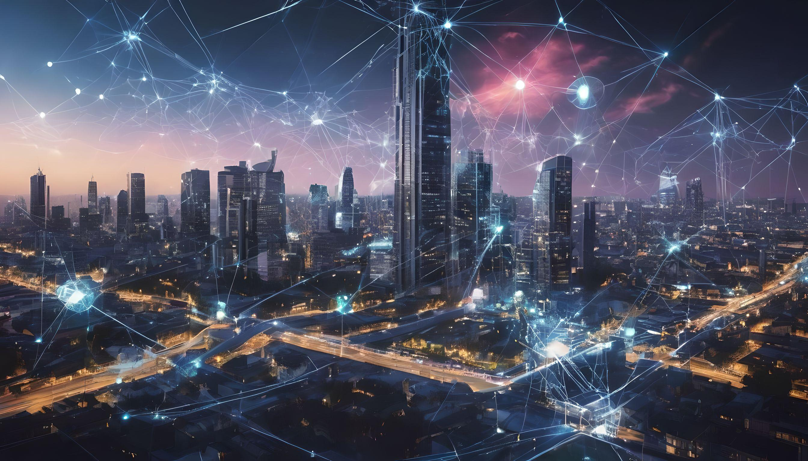

### Módulo 29: Redes 5G e Futuras Tecnologias

#### Introdução

A tecnologia de redes móveis evolui continuamente para atender às crescentes demandas por conectividade mais rápida, confiável e abrangente. O 5G, a quinta geração de redes móveis, representa um salto significativo em relação às gerações anteriores, prometendo revolucionar diversos setores com suas capacidades avançadas. Este módulo explora os fundamentos das redes 5G e discute as perspectivas de futuras tecnologias emergentes.

#### 1. Fundamentos das Redes 5G

**1.1 Evolução das Redes Móveis**

As redes móveis evoluíram significativamente ao longo das últimas décadas, cada geração trazendo inovações que ampliaram a capacidade e a funcionalidade das redes.

- **1G**: Focado em chamadas de voz analógicas.
- **2G**: Introduziu chamadas de voz digital e mensagens SMS.
- **3G**: Ofereceu acesso à internet móvel com maior largura de banda.
- **4G/LTE**: Proporcionou velocidades de internet móvel de banda larga, permitindo streaming de vídeo e outras aplicações intensivas de dados.
- **5G**: Promete altas velocidades, baixa latência e a capacidade de conectar um número massivo de dispositivos simultaneamente.

**1.2 Arquitetura das Redes 5G**

A arquitetura 5G é projetada para ser flexível e escalável, composta por vários componentes-chave:

- **Core Network (Rede Núcleo)**: O coração da rede 5G, responsável pela gestão de dados e conectividade.
- **RAN (Radio Access Network)**: Componentes que conectam dispositivos móveis à rede núcleo, utilizando frequências de rádio.
- **Edge Computing**: Processamento de dados próximo à fonte de dados, reduzindo a latência e melhorando a eficiência.

**1.3 Características Principais do 5G**

- **Velocidade Ultra-Rápida**: Taxas de dados que podem chegar a 10 Gbps.
- **Baixa Latência**: Latência de apenas 1 ms, essencial para aplicações em tempo real.
- **Capacidade Massiva**: Suporta até um milhão de dispositivos por quilômetro quadrado.
- **Eficiência Energética**: Melhor utilização de energia para prolongar a vida útil da bateria dos dispositivos.
- **Confiabilidade Elevada**: Projetada para ser extremamente confiável, adequada para aplicações críticas.

#### 2. Aplicações e Impacto do 5G

**2.1 Internet das Coisas (IoT)**

O 5G facilita a expansão da IoT, permitindo a conectividade de um vasto número de dispositivos com diferentes requisitos de largura de banda e latência.

- **Casas Inteligentes**: Automação e controle remoto de dispositivos domésticos.
- **Cidades Inteligentes**: Gerenciamento eficiente de recursos urbanos como energia, água e tráfego.
- **Indústria 4.0**: Automação avançada e monitoramento em tempo real na fabricação e logística.

**2.2 Realidade Aumentada (AR) e Realidade Virtual (VR)**

- **Entretenimento**: Experiências de AR e VR imersivas em jogos e mídia.
- **Educação**: Simulações e ambientes de aprendizagem virtual.
- **Saúde**: Treinamento médico e cirurgias assistidas por AR/VR.

**2.3 Veículos Autônomos**

- **Comunicação V2X (Vehicle-to-Everything)**: Conectividade em tempo real entre veículos e a infraestrutura de transporte para melhorar a segurança e eficiência.

#### 3. Futuras Tecnologias e Perspectivas

**3.1 6G: A Próxima Fronteira**

Embora o 5G ainda esteja em fase de implementação global, pesquisas sobre o 6G já começaram, prometendo ainda mais avanços.

- **Espectro de Frequência Mais Alto**: Utilização de frequências acima de 100 GHz.
- **Velocidades Terabits por Segundo**: Objetivo de alcançar velocidades na ordem de terabits por segundo.
- **Inteligência Artificial**: Integração profunda de IA para otimização de redes e serviços.

**3.2 Redes Quânticas**

- **Criptografia Quântica**: Utilização de princípios da mecânica quântica para criar métodos de criptografia inquebráveis.
- **Comunicação Quântica**: Promete transferências de dados seguras e instantâneas.

**3.3 Tecnologias de Comunicação Espacial**

- **Satélites em Órbita Baixa (LEO)**: Proporcionam conectividade global, inclusive em áreas remotas.
- **Redes Interplanetárias**: Desenvolvimento de infraestrutura de comunicação para futuras missões espaciais e colonização de outros planetas.

#### Conclusão

As redes 5G representam uma revolução na conectividade móvel, com impactos significativos em diversas indústrias e no cotidiano das pessoas. Com a evolução contínua das tecnologias de rede, como o 6G e as redes quânticas, o futuro promete ainda mais inovação e possibilidades. A compreensão desses avanços é crucial para profissionais de TI e entusiastas de tecnologia, preparando-os para um futuro cada vez mais conectado e inteligente.

---

### Atividade Avaliativa de Múltipla Escolha

1. **Qual das seguintes características é uma melhoria significativa do 5G em comparação com o 4G?**
   - a) Velocidade de dados de até 1 Gbps
   - b) Latência de 10 ms
   - c) Suporte para até 100 dispositivos por quilômetro quadrado
   - d) Velocidade de dados de até 10 Gbps

2. **Qual componente da arquitetura 5G é responsável pelo processamento de dados próximo à fonte de dados para reduzir a latência?**
   - a) Core Network
   - b) Radio Access Network (RAN)
   - c) Edge Computing
   - d) Data Center

3. **Em qual frequência as redes 6G estão planejadas para operar?**
   - a) Abaixo de 1 GHz
   - b) Entre 1 GHz e 6 GHz
   - c) Entre 6 GHz e 30 GHz
   - d) Acima de 100 GHz

4. **Qual tecnologia futura promete utilizar princípios da mecânica quântica para criar métodos de criptografia inquebráveis?**
   - a) 5G
   - b) 6G
   - c) Redes Quânticas
   - d) Comunicações Espaciais

5. **Qual aplicação do 5G envolve a comunicação em tempo real entre veículos e a infraestrutura de transporte?**
   - a) Realidade Virtual
   - b) Indústria 4.0
   - c) Cidades Inteligentes
   - d) V2X (Vehicle-to-Everything)

   **Resposta 1: d) Velocidade de dados de até 10 Gbps**
   **Resposta 2: c) Edge Computing**
   **Resposta 3: d) Acima de 100 GHz**
   **Resposta 4: c) Redes Quânticas**
   **Resposta 5: d) V2X (Vehicle-to-Everything)**